# WaongDaong - AI 기반 영어 학습 플랫폼

## 📱 프로젝트 개요

WaongDaong은 AI를 활용한 혁신적인 영어 학습 플랫폼입니다. 개인 학습과 그룹 학습을 모두 지원하며, AI가 학습자의 수준과 목표에 맞는 맞춤형 콘텐츠와 스크립트를 제공합니다.

## 🎯 주요 기능

### 1. **AI 기반 학습 지원**
- **AI 스크립트 생성**: 한국어 입력 → 영어 스크립트 자동 생성
- **맞춤형 난이도**: Beginner, Intermediate, Advanced 레벨별 맞춤 학습
- **컨텍스트 기반**: 학습 상황에 맞는 적절한 영어 표현 제공

### 2. **개인 학습 (Individual Learning)**
- **콘텐츠 기반 학습**: 뉴스, 논문, 칼럼 등 다양한 콘텐츠로 학습
- **퀴즈 시스템**: 이해도 측정 및 점수 기반 포인트 적립
- **학습 결과 분석**: AI가 분석한 개인 학습 리포트 제공
- **단어장 관리**: 학습한 단어들을 체계적으로 관리

### 3. **그룹 학습 (Study Group)**
- **실시간 스터디**: 화상 회의를 통한 그룹 학습
- **AI 스크립트 지원**: 말하고 싶은 내용을 한국어로 입력하면 영어 스크립트 제공
- **참여도 분석**: 발언 횟수, 시간, 협업 효과 등 분석
- **그룹 리포트**: AI가 생성한 그룹 학습 결과 리포트

### 4. **포인트 시스템**
- **학습 보상**: 학습 완료 시 포인트 적립
- **참여 보상**: 그룹 학습 참여 시 추가 포인트
- **포인트 교환**: 다양한 혜택으로 포인트 사용

## 🏗️ 아키텍처 및 모듈 구조

### **모듈 기반 아키텍처**
```
lib/
├── main.dart                    # 앱 진입점
├── modules/
│   ├── app_module_manager.dart  # 전체 모듈 관리
│   ├── core/                    # 핵심 유틸리티
│   ├── supabase/                # 데이터베이스 및 인증
│   ├── ai/                      # AI API 서비스
│   ├── ai_script/               # AI 스크립트 생성
│   ├── auth/                    # 사용자 인증
│   ├── content/                 # 콘텐츠 관리
│   ├── learning/                # 학습 세션 관리
│   ├── study/                   # 스터디 그룹
│   ├── user/                    # 사용자 관리
│   ├── report/                  # 리포트 생성
│   └── point/                   # 포인트 시스템
```

### **핵심 모듈 설명**
- **AppModuleManager**: 모든 모듈의 생명주기 관리
- **SupabaseModule**: Supabase 클라이언트 및 서비스 관리
- **AIModule**: Google Gemini 2.0 Flash API 연동
- **AiScriptModule**: AI 스크립트 생성 및 관리
- **CoreModule**: 공통 유틸리티 및 Result 패턴

## 🗄️ 데이터베이스 ERD (상세)

### **핵심 엔티티 관계**

```mermaid
erDiagram
    %% 사용자 관련
    users {
        uuid id PK
        text email UK
        timestamp created_at
        timestamp updated_at
    }
    
    user_profiles {
        uuid id PK
        uuid user_id FK
        text nickname
        text current_level
        text target_level
        integer toeic_score
        integer toeic_speaking_score
        integer toeic_writing_score
        timestamp created_at
        timestamp updated_at
    }
    
    user_interests {
        uuid id PK
        uuid user_id FK
        text interest_category
        timestamp created_at
    }
    
    %% 콘텐츠 관련
    contents {
        uuid id PK
        text title
        text content
        text content_type
        text source_url
        text difficulty_level
        timestamp created_at
        timestamp updated_at
    }
    
    content_categories {
        uuid id PK
        uuid content_id FK
        text category
        timestamp created_at
    }
    
    %% 개인 학습 관련
    learning_sessions {
        uuid id PK
        uuid user_id FK
        uuid content_id FK
        timestamp started_at
        timestamp completed_at
        text status
        integer study_time
        integer comprehension_score
        timestamp created_at
    }
    
    learning_results {
        uuid id PK
        uuid learning_session_id FK
        integer quiz_score
        text summary
        text translation
        integer earned_points
        timestamp created_at
    }
    
    user_vocabulary {
        uuid id PK
        uuid user_id FK
        text word
        text meaning
        text example_sentence
        integer mastery_level
        timestamp created_at
        timestamp updated_at
    }
    
    %% 스터디 그룹 관련
    study_groups {
        uuid id PK
        text title
        text description
        integer max_participants
        integer current_participants
        timestamp start_time
        timestamp end_time
        text status
        text topic
        text category
        uuid created_by FK
        timestamp created_at
        timestamp updated_at
    }
    
    study_group_participants {
        uuid id PK
        uuid study_group_id FK
        uuid user_id FK
        timestamp joined_at
        text role
        text status
    }
    
    study_participant_records {
        uuid id PK
        uuid study_group_id FK
        uuid user_id FK
        integer speaking_time
        integer speaking_count
        integer participation_score
        timestamp created_at
    }
    
    %% AI 스크립트 관련
    ai_scripts {
        uuid id PK
        uuid study_group_id FK
        uuid user_id FK
        text korean_input
        text english_script
        text basic_prompt
        text context
        text difficulty
        text topic
        timestamp created_at
        timestamp updated_at
    }
    
    %% 리포트 관련
    reports {
        uuid id PK
        uuid user_id FK
        uuid study_group_id FK
        uuid learning_session_id FK
        text title
        text content
        text report_type
        timestamp created_at
        timestamp updated_at
    }
    
    study_reports {
        uuid id PK
        uuid study_group_id FK
        text summary
        decimal participation_rate
        text feedback
        text learning_direction
        text reflection
        timestamp created_at
    }
    
    user_learning_reports {
        uuid id PK
        uuid user_id FK
        text period
        integer total_study_time
        integer completed_contents
        integer earned_points
        text weak_areas
        text recommendations
        timestamp created_at
    }
    
    %% 포인트 관련
    user_points {
        uuid id PK
        uuid user_id FK
        integer points
        integer total_earned
        integer total_spent
        timestamp updated_at
    }
    
    point_transactions {
        uuid id PK
        uuid user_id FK
        integer points
        text transaction_type
        text source
        text description
        text reference_type
        uuid reference_id
        timestamp created_at
    }
    
    %% 기타
    user_scraps {
        uuid id PK
        uuid user_id FK
        uuid content_id FK
        timestamp scrapped_at
    }
    
    %% 관계 정의
    users ||--|| user_profiles : "1:1"
    users ||--o{ user_interests : "1:N"
    users ||--o{ learning_sessions : "1:N"
    users ||--o{ user_vocabulary : "1:N"
    users ||--o{ user_scraps : "1:N"
    users ||--|| user_points : "1:1"
    users ||--o{ point_transactions : "1:N"
    users ||--o{ user_learning_reports : "1:N"
    users ||--o{ reports : "1:N"
    
    contents ||--o{ learning_sessions : "1:N"
    contents ||--o{ content_categories : "1:N"
    contents ||--o{ user_scraps : "1:N"
    
    learning_sessions ||--|| learning_results : "1:1"
    learning_sessions ||--o{ reports : "1:N"
    
    study_groups ||--o{ study_group_participants : "1:N"
    study_groups ||--o{ study_participant_records : "1:N"
    study_groups ||--o{ ai_scripts : "1:N"
    study_groups ||--|| study_reports : "1:1"
    study_groups ||--o{ reports : "1:N"
    study_groups }o--|| users : "N:1"
    
    users ||--o{ study_group_participants : "1:N"
    users ||--o{ study_participant_records : "1:N"
    users ||--o{ ai_scripts : "1:N"
```



## 🔄 데이터 플로우

### **1. 개인 학습 플로우**
```
사용자 로그인 → 콘텐츠 선택 → 학습 시작 → 퀴즈 응답 → 
학습 결과 저장 → AI 리포트 생성 → 포인트 적립
```

### **2. 그룹 학습 플로우**
```
스터디그룹 생성 → 참가자 초대 → 학습 시작 → 
AI 스크립트 생성 → 학습 진행 → 참여도 기록 → 
AI 리포트 생성 → 포인트 적립
```

### **3. AI 스크립트 생성 플로우**
```
한국어 입력 → AI 모듈로 전송 → Gemini API 호출 → 
영어 스크립트 생성 → 데이터베이스 저장 → 사용자에게 제공
```

## 🤖 AI 시스템 상세

### **AI 모듈 (Gemini 2.0 Flash)**
- **API**: Google Gemini 2.0 Flash 모델
- **용도**: 영어 스크립트 생성, 학습 리포트 분석
- **특징**: 빠른 응답, 높은 품질, 한국어 이해 우수
- **구현**: `AIApiService`를 통한 HTTP API 호출
- **프롬프트**: 영어 학습 전문가 역할 정의

### **AI 스크립트 서비스**
- **생성**: 한국어 입력 + 기본 프롬프트 → 영어 스크립트
- **저장**: Supabase 데이터베이스에 자동 저장
- **관리**: CRUD 작업 지원 (생성, 조회, 수정, 삭제)
- **컨텍스트**: 학습 상황별 맞춤형 스크립트

## 📊 리포트 시스템

### **개인학습 리포트**
- **학습 시간 분석**: 총 학습 시간, 평균 세션 시간
- **성취도 분석**: 퀴즈 점수, 완료한 콘텐츠 수
- **취약점 분석**: AI가 분석한 개선이 필요한 영역
- **학습 방향성**: AI가 제안하는 향후 학습 계획

### **그룹학습 리포트**
- **참여도 분석**: 발언 횟수, 시간, 품질
- **협업 효과**: 그룹 내 역할, 상호작용 품질
- **학습 성과**: 그룹 전체의 학습 진행 상황
- **개선점**: 그룹 학습 효율성 향상을 위한 제안

## 🎯 포인트 시스템

### **적립 조건**
- **학습 완료**: 콘텐츠 학습 완료 시 기본 포인트
- **퀴즈 성과**: 높은 점수 시 보너스 포인트
- **그룹 참여**: 스터디그룹 참여 시 추가 포인트
- **연속 학습**: 연속 학습 시 누적 보너스

### **사용 방법**
- **콘텐츠 구매**: 프리미엄 콘텐츠 구매
- **기능 해금**: 고급 기능 사용 권한
- **배지 획득**: 특별한 성취 배지
- **리더보드**: 포인트 순위 경쟁

## 🚀 기술 스택

### **Frontend**
- **Flutter**: 크로스 플랫폼 모바일 앱 (SDK 3.7.2+)
- **Dart**: 프로그래밍 언어
- **Provider**: 상태 관리

### **Backend & Database**
- **Supabase**: 데이터베이스, 인증, 스토리지
- **PostgreSQL**: 관계형 데이터베이스
- **Row Level Security**: 데이터 보안

### **AI/ML**
- **Google Gemini 2.0 Flash**: 자연어 처리
- **Custom Prompts**: 도메인 특화 프롬프트
- **Context Awareness**: 상황 인식 학습

### **Infrastructure**
- **Supabase Cloud**: 호스팅 및 관리
- **Real-time**: 실시간 데이터 동기화
- **Edge Functions**: 서버리스 함수

### **의존성 패키지**
```yaml
dependencies:
  flutter: sdk: flutter
  supabase_flutter: ^2.9.1
  flutter_dotenv: ^5.1.0
  json_annotation: ^4.8.1
  http: ^1.1.0
  uuid: ^4.0.0
  google_generative_ai: ^0.4.6
```

## 🏗️ 코드 구조 및 패턴

### **모듈 패턴**
- **싱글톤 패턴**: `AppModuleManager`, `SupabaseModule`
- **의존성 주입**: 모듈 간 느슨한 결합
- **계층 구조**: Service → Repository → Model

### **Result 패턴**
- **성공/실패/로딩 상태**: 타입 안전한 결과 처리
- **에러 핸들링**: 체이닝 방식의 콜백 처리
- **Null 안전성**: Dart의 null safety 활용

### **서비스 레이어**
- **AIScriptService**: AI 스크립트 생성 및 관리
- **AuthService**: 사용자 인증 및 세션 관리
- **DatabaseService**: 데이터베이스 CRUD 작업
- **StorageService**: 파일 업로드 및 관리

## 📱 사용자 인터페이스

### **메인 화면 (3개 탭)**
1. **콘텐츠 탭**: 뉴스/논문/칼럼 리스트, 상세 페이지, 스크랩
2. **스터디그룹 탭**: 그룹 목록, 그룹 상세, 실시간 학습
3. **마이페이지 탭**: 프로필, 리포트, 스크랩, 포인트

### **학습 화면**
- **콘텐츠 뷰어**: 원문 표시, 번역 도구
- **퀴즈 시스템**: 이해도 측정, 즉시 피드백
- **AI 스크립트**: 실시간 영어 표현 생성
- **진행률 표시**: 학습 진행 상황 시각화

## 🔒 보안 및 개인정보

### **데이터 보안**
- **Row Level Security**: 사용자별 데이터 접근 제어
- **암호화**: 민감한 데이터 암호화 저장
- **인증**: Supabase Auth를 통한 안전한 인증

### **개인정보 보호**
- **최소 권한**: 필요한 데이터만 수집
- **사용자 동의**: 명시적인 동의 후 데이터 처리
- **데이터 삭제**: 계정 삭제 시 모든 데이터 완전 제거

## 🚧 개발 로드맵

### **Phase 1: 기본 기능 (완료)**
- [x] 사용자 인증 시스템
- [x] 기본 모듈 구조
- [x] AI 스크립트 생성
- [x] 데이터베이스 설계
- [x] 모듈 매니저 구현
- [x] Result 패턴 구현

### **Phase 2: 핵심 기능 (진행 중)**
- [x] 개인학습 시스템
- [x] 그룹학습 시스템
- [x] 리포트 생성
- [x] 포인트 시스템
- [x] Supabase 연동
- [x] AI API 서비스

### **Phase 3: 고급 기능 (계획)**
- [ ] 음성 인식 및 발음 평가
- [ ] 개인화된 학습 경로
- [ ] 소셜 기능 (친구, 팔로우)
- [ ] 게이미피케이션 강화

---

**WaongDaong** - AI와 함께하는 혁신적인 영어 학습 경험 🚀