# WaongDaong - AI 기반 영어 학습 플랫폼

## 📱 프로젝트 개요

WaongDaong은 AI를 활용한 혁신적인 영어 학습 플랫폼입니다. 개인 학습과 그룹 학습을 모두 지원하며, AI가 학습자의 수준과 목표에 맞는 맞춤형 콘텐츠와 스크립트를 제공합니다.

## 🎯 주요 기능

### 1. **AI 기반 학습 지원**
- **AI 스크립트 생성**: 한국어 입력 → 영어 스크립트 자동 생성
- **맞춤형 난이도**: Beginner, Intermediate, Advanced 레벨별 맞춤 학습
- **컨텍스트 기반**: 학습 상황에 맞는 적절한 영어 표현 제공

### 2. **개인 학습 (Individual Learning)**
- **콘텐츠 기반 학습**: 뉴스, 논문, 칼럼 등 다양한 콘텐츠로 학습
- **콘텐츠 스크랩**: 관심 있는 콘텐츠를 스크랩하여 나중에 다시 학습
- **퀴즈 시스템**: 이해도 측정 및 점수 기반 포인트 적립
- **학습 결과 분석**: AI가 분석한 개인 학습 리포트 제공
- **단어장 관리**: 학습한 단어들을 체계적으로 관리

### 3. **그룹 학습 (Study Group)**
- **실시간 스터디**: 화상 회의를 통한 그룹 학습
- **AI 스크립트 지원**: 말하고 싶은 내용을 한국어로 입력하면 영어 스크립트 제공
- **참여도 분석**: 발언 횟수, 시간, 협업 효과 등 분석
- **그룹 리포트**: AI가 생성한 그룹 학습 결과 리포트

### 4. **포인트 시스템**
- **학습 보상**: 학습 완료 시 포인트 적립
- **참여 보상**: 그룹 학습 참여 시 추가 포인트
- **포인트 교환**: 다양한 혜택으로 포인트 사용

## 🏗️ 아키텍처 및 모듈 구조

### **모듈 기반 아키텍처**
```
lib/
├── main.dart                    # 앱 진입점
├── modules/
│   ├── app_module_manager.dart  # 전체 모듈 관리
│   ├── core/                    # 핵심 유틸리티
│   ├── supabase/                # 데이터베이스 및 인증
│   ├── ai/                      # AI API 서비스
│   ├── ai_script/               # AI 스크립트 생성
│   ├── auth/                    # 사용자 인증
│   ├── content/                 # 콘텐츠 관리
│   ├── learning/                # 학습 세션 관리
│   ├── study/                   # 스터디 그룹
│   ├── user/                    # 사용자 관리
│   ├── report/                  # 리포트 생성
│   ├── point/                   # 포인트 시스템
│   └── quiz/                    # AI 기반 퀴즈 시스템
```

### **핵심 모듈 설명**
- **AppModuleManager**: 모든 모듈의 생명주기 관리
- **SupabaseModule**: Supabase 클라이언트 및 서비스 관리
- **AIModule**: Google Gemini 2.0 Flash API 연동
- **AiScriptModule**: AI 스크립트 생성 및 관리
- **CoreModule**: 공통 유틸리티 및 Result 패턴

## 🗄️ 데이터베이스 ERD (상세)

### **핵심 엔티티 관계**

```mermaid
erDiagram
    %% 사용자 관련
    users {
        uuid id PK
        text email UK
        timestamp created_at
        timestamp updated_at
    }
    
    user_profiles {
        uuid id PK
        uuid user_id FK
        text nickname
        text current_level
        text target_level
        integer toeic_score
        integer toeic_speaking_score
        integer toeic_writing_score
        timestamp created_at
        timestamp updated_at
    }
    
    user_interests {
        uuid id PK
        uuid user_id FK
        text interest_category
        timestamp created_at
    }
    
    %% 콘텐츠 관련
    contents {
        uuid id PK
        text title
        text content
        text content_type
        text source_url
        text difficulty_level
        timestamp created_at
        timestamp updated_at
    }
    
    content_categories {
        uuid id PK
        uuid content_id FK
        text category
        timestamp created_at
    }
    
    %% 개인 학습 관련
    learning_sessions {
        uuid id PK
        uuid user_id FK
        uuid content_id FK
        timestamp started_at
        timestamp completed_at
        text status
        integer study_time
        integer comprehension_score
        timestamp created_at
    }
    
    learning_results {
        uuid id PK
        uuid learning_session_id FK
        integer quiz_score
        text summary
        text translation
        integer earned_points
        timestamp created_at
    }
    
    user_vocabulary {
        uuid id PK
        uuid user_id FK
        text word
        text meaning
        text example_sentence
        integer mastery_level
        timestamp created_at
        timestamp updated_at
    }
    
    %% 스터디 그룹 관련
    study_groups {
        uuid id PK
        text title
        text description
        integer max_participants
        integer current_participants
        timestamp start_time
        timestamp end_time
        text status
        text topic
        text category
        uuid created_by FK
        timestamp created_at
        timestamp updated_at
    }
    
    study_group_participants {
        uuid id PK
        uuid study_group_id FK
        uuid user_id FK
        timestamp joined_at
        text role
        text status
    }
    
    study_participant_records {
        uuid id PK
        uuid study_group_id FK
        uuid user_id FK
        integer speaking_time
        integer speaking_count
        integer participation_score
        timestamp created_at
    }
    
    %% AI 스크립트 관련
    ai_scripts {
        uuid id PK
        uuid study_group_id FK
        uuid user_id FK
        text korean_input
        text english_script
        text basic_prompt
        text context
        text difficulty
        text topic
        timestamp created_at
        timestamp updated_at
    }
    
    %% 리포트 관련 (통합 모델)
    reports {
        uuid id PK
        uuid user_id FK
        uuid study_group_id FK
        uuid learning_session_id FK
        text title
        text content
        text report_type
        text ai_feedback
        text user_reflection
        timestamp created_at
        timestamp updated_at
    }
    
    %% 포인트 관련
    user_points {
        uuid id PK
        uuid user_id FK
        integer points
        integer total_earned
        integer total_spent
        timestamp updated_at
    }
    
    point_transactions {
        uuid id PK
        uuid user_id FK
        integer points
        text transaction_type
        text source
        text description
        text reference_type
        uuid reference_id
        timestamp created_at
    }
    
    %% 퀴즈 시스템 관련
    quizzes {
        uuid id PK
        uuid content_id FK
        text quiz_type
        text question
        text correct_answer
        jsonb options
        text excerpt
        text difficulty_level
        integer points
        timestamp created_at
        timestamp updated_at
    }
    
    quiz_attempts {
        uuid id PK
        uuid quiz_id FK
        uuid user_id FK
        text user_answer
        boolean is_correct
        integer score
        integer time_spent
        jsonb ai_evaluation
        timestamp created_at
    }
    
    content_quiz_progress {
        uuid id PK
        uuid user_id FK
        uuid content_id FK
        integer total_quizzes
        integer completed_quizzes
        decimal average_score
        timestamp last_attempt_at
        timestamp created_at
        timestamp updated_at
    }
    
    %% 기타
    user_scraps {
        uuid id PK
        uuid user_id FK
        uuid content_id FK
        timestamp scrapped_at
    }
    
    %% 관계 정의
    users ||--|| user_profiles : "1:1"
    users ||--o{ user_interests : "1:N"
    users ||--o{ learning_sessions : "1:N"
    users ||--o{ user_vocabulary : "1:N"
    users ||--o{ user_scraps : "1:N"
    users ||--|| user_points : "1:1"
    users ||--o{ point_transactions : "1:N"
    users ||--o{ reports : "1:N"
    users ||--o{ quiz_attempts : "1:N"
    users ||--o{ content_quiz_progress : "1:N"
    users ||--o{ study_group_participants : "1:N"
    users ||--o{ study_participant_records : "1:N"
    users ||--o{ ai_scripts : "1:N"
    
    contents ||--o{ learning_sessions : "1:N"
    contents ||--o{ content_categories : "1:N"
    contents ||--o{ user_scraps : "1:N"
    contents ||--o{ quizzes : "1:N"
    contents ||--o{ content_quiz_progress : "1:N"
    
    learning_sessions ||--|| learning_results : "1:1"
    learning_sessions ||--o{ reports : "1:N"
    
    quizzes ||--o{ quiz_attempts : "1:N"
    
    study_groups ||--o{ study_group_participants : "1:N"
    study_groups ||--o{ study_participant_records : "1:N"
    study_groups ||--o{ ai_scripts : "1:N"
    study_groups }o--|| users : "N:1"
```



## 🔄 데이터 플로우

### **1. 개인 학습 플로우**
```
사용자 로그인 → 콘텐츠 선택 → 학습 시작 → 퀴즈 응답 → 
학습 결과 저장 → AI 리포트 생성 → 포인트 적립
```

### **2. 콘텐츠 스크랩 플로우**
```
콘텐츠 조회 → 스크랩 버튼 클릭 → 스크랩 저장 → 
스크랩 목록에서 확인 → 스크랩 기반 추천 콘텐츠 제공
```

### **3. 그룹 학습 플로우**
```
스터디그룹 생성 → 참가자 초대 → 학습 시작 → 
AI 스크립트 생성 → 학습 진행 → 참여도 기록 → 
AI 리포트 생성 → 포인트 적립
```

### **4. AI 스크립트 생성 플로우**
```
한국어 입력 → AI 모듈로 전송 → Gemini API 호출 → 
영어 스크립트 생성 → 데이터베이스 저장 → 사용자에게 제공
```

### **5. AI 시스템**
```
AI 모듈을 통한 퀴즈 생성 및 평가
- 퀴즈 문제 자동 생성
- 답안 AI 평가 (요약/번역)
- 학습 리포트 AI 생성
```

## 🤖 AI 시스템 상세

### **AI 모듈 (Gemini 2.0 Flash)**
- **API**: Google Gemini 2.0 Flash 모델
- **용도**: 영어 스크립트 생성, 퀴즈 생성, 답안 평가, 학습 리포트 분석
- **특징**: 빠른 응답, 높은 품질, 한국어 이해 우수
- **구현**: `AIApiService`를 통한 HTTP API 호출
- **프롬프트**: 영어 학습 전문가 역할 정의

### **AI 스크립트 서비스**
- **생성**: 한국어 입력 + 기본 프롬프트 → 영어 스크립트
- **저장**: Supabase 데이터베이스에 자동 저장
- **관리**: CRUD 작업 지원 (생성, 조회, 수정, 삭제)
- **컨텍스트**: 학습 상황별 맞춤형 스크립트

### **AI 퀴즈 서비스**
- **생성**: 콘텐츠 기반 퀴즈 자동 생성 (단어, 요약, 번역)
- **평가**: 요약/번역 답안 AI 평가 및 피드백
- **리포트**: 학습 성과 분석 및 개인화된 조언 제공
- **개인화**: 사용자 수준에 맞는 맞춤형 학습 전략

## 📊 리포트 시스템

### **통합 리포트 모델 (Report)**
- **유형**: 개인학습 리포트와 그룹학습 리포트를 하나의 테이블로 통합
- **구조**: `Report` 모델로 구현되어 `ReportService`를 통해 관리
- **AI 피드백**: `aiFeedback` 필드에 AI가 생성한 분석 결과 저장
- **사용자 후기**: `userReflection` 필드에 사용자가 직접 입력하는 소감 저장

### **개인학습 리포트**
- **연결**: `learning_session_id`로 개별 학습 세션과 연결
- **생성**: `createLearningReport()` 메서드로 생성
- **AI 분석**: 학습 패턴, 취약점, 개선 방향을 AI가 자동 분석
- **사용자 입력**: 학습 후 느낀 점이나 소감을 직접 작성

### **그룹학습 리포트**
- **연결**: `study_group_id`로 스터디 그룹과 연결
- **생성**: `createStudyGroupReport()` 메서드로 생성
- **AI 분석**: 그룹 참여도, 협업 효과, 전체 성과를 AI가 분석
- **사용자 입력**: 그룹 학습에 대한 개인적인 후기 작성

### **AI 피드백 vs 사용자 후기**
| 구분 | AI 피드백 (aiFeedback) | 사용자 후기 (userReflection) |
|------|------------------------|------------------------------|
| **생성자** | AI 자동 생성 | 사용자 직접 입력 |
| **내용** | 객관적 분석 결과 | 주관적 경험담 |
| **용도** | 학습 방향 제시 | 개인적 성찰 및 기록 |
| **업데이트** | 학습 데이터 기반 자동 | 사용자가 언제든 수정 가능 |

### **실제 구현된 기능**
- **CRUD 작업**: `ReportService`를 통한 생성, 조회, 수정, 삭제
- **타입 안전성**: `ReportType` 열거형으로 개인학습/그룹학습 구분
- **사용자별 관리**: `getUserReports()`, `getStudyGroupReports()` 메서드

## 🎯 포인트 시스템

### **적립 조건**
- **학습 완료**: 콘텐츠 학습 완료 시 기본 포인트
- **퀴즈 성과**: 높은 점수 시 보너스 포인트
- **그룹 참여**: 스터디그룹 참여 시 추가 포인트
- **연속 학습**: 연속 학습 시 누적 보너스

## 📚 콘텐츠 스크랩 시스템

### **주요 기능**
- **스크랩/언스크랩**: 관심 있는 콘텐츠를 저장하고 관리
- **스크랩 목록**: 사용자별 스크랩한 콘텐츠 목록 조회
- **스크랩 수 표시**: 각 콘텐츠의 스크랩 수 실시간 표시
- **스크랩 기반 추천**: 사용자의 스크랩 패턴을 분석하여 맞춤형 콘텐츠 추천

### **기술적 특징**
- **중복 방지**: 동일 콘텐츠 중복 스크랩 방지
- **실시간 동기화**: 스크랩 상태 변경 시 즉시 반영
- **페이지네이션**: 대량의 스크랩 데이터 효율적 처리
- **보안**: RLS를 통한 사용자별 데이터 접근 제어

### **데이터 구조**
```sql
user_scraps {
    id: UUID (PK)
    user_id: UUID (FK to auth.users)
    content_id: UUID (FK to content)
    scrapped_at: TIMESTAMP
}
```

### **API 엔드포인트**
- `POST /user_scraps`: 콘텐츠 스크랩
- `DELETE /user_scraps`: 콘텐츠 언스크랩
- `GET /user_scraps`: 사용자별 스크랩 목록
- `GET /user_scraps/count`: 스크랩 수 조회

### **사용 방법**
- **콘텐츠 구매**: 프리미엄 콘텐츠 구매
- **기능 해금**: 고급 기능 사용 권한
- **배지 획득**: 특별한 성취 배지
- **리더보드**: 포인트 순위 경쟁

## 🧠 퀴즈 시스템 (AI 기반 개인 학습)

### **시스템 개요**
퀴즈 시스템은 AI를 활용하여 콘텐츠별로 맞춤형 학습 문제를 자동 생성하고, 사용자의 답안을 AI가 평가하여 개인화된 학습 경험을 제공합니다.

### **주요 특징**
- **AI 자동 생성**: Gemini 2.0 Flash 모델을 활용한 문제 자동 생성
- **매번 새로운 퀴즈**: 같은 콘텐츠도 매번 다른 문제로 학습 가능
- **실시간 평가**: AI가 답안을 즉시 평가하고 구체적인 피드백 제공
- **진행 상황 추적**: 사용자별 퀴즈 진행 상황 및 성과 분석

### **퀴즈 유형**

#### **🔤 단어 퀴즈 (Vocabulary)**
- **문제 형식**: "What does '[단어]' mean in this context?"
- **답안 형식**: 4지 선다형 (정답 + 오답 3개)
- **평가 방식**: 정확한 매칭
- **점수**: 10점
- **AI 활용**: 콘텐츠에서 중요한 단어 추출 및 문맥 기반 문제 생성

#### **📝 요약 퀴즈 (Summary)**
- **문제 형식**: "Summarize the following passage in English:"
- **답안 형식**: 자유 서술형
- **평가 방식**: AI 기반 평가 (정확성 50%, 완성도 30%, 자연스러움 20%)
- **점수**: 20점
- **AI 활용**: 콘텐츠 발췌 및 모범 답안 생성

#### **🌐 번역 퀴즈 (Translation)**
- **문제 형식**: "Translate the following sentence into Korean:"
- **답안 형식**: 자유 서술형
- **평가 방식**: AI 기반 평가
- **점수**: 15점
- **AI 활용**: 영어 문장 발췌 및 정확한 한국어 번역 제공

### **데이터 구조**

#### **quizzes 테이블**
```sql
quizzes {
    id: UUID (PK)
    content_id: UUID (FK to contents)
    quiz_type: TEXT (vocabulary/summary/translation)
    question: TEXT
    correct_answer: TEXT
    options: JSONB (단어 퀴즈용 선택지)
    excerpt: TEXT (요약/번역용 발췌 텍스트)
    difficulty_level: TEXT (beginner/intermediate/advanced)
    points: INTEGER
    created_at: TIMESTAMP
    updated_at: TIMESTAMP
}
```

#### **quiz_attempts 테이블**
```sql
quiz_attempts {
    id: UUID (PK)
    quiz_id: UUID (FK to quizzes)
    user_id: UUID (FK to users)
    user_answer: TEXT
    is_correct: BOOLEAN
    score: INTEGER
    time_spent: INTEGER (초 단위)
    ai_evaluation: JSONB (AI 평가 결과 - 요약/번역 퀴즈만)
    created_at: TIMESTAMP
}
```

#### **content_quiz_progress 테이블**
```sql
content_quiz_progress {
    id: UUID (PK)
    user_id: UUID (FK to users)
    content_id: UUID (FK to contents)
    total_quizzes: INTEGER
    completed_quizzes: INTEGER
    average_score: DECIMAL(5,2)
    last_attempt_at: TIMESTAMP
    created_at: TIMESTAMP
    updated_at: TIMESTAMP
}
```

### **AI 활용 방식**

#### **1. 퀴즈 생성**
```dart
// AI 프롬프트 예시 (단어 퀴즈)
final prompt = '''
다음 영어 텍스트에서 5개의 단어 퀴즈를 생성해주세요.
난이도: intermediate
형식: JSON 배열

각 퀴즈는 다음 형식이어야 합니다:
{
  "word": "단어",
  "question": "What does '[단어]' mean in this context?",
  "correct_answer": "정답",
  "options": ["정답", "오답1", "오답2", "오답3"]
}

텍스트: [콘텐츠 내용]

응답은 순수 JSON 배열만 제공해주세요.
''';
```

#### **2. 답안 평가**
```dart
// AI 평가 프롬프트 예시
final prompt = '''
다음 요약 답안을 평가해주세요.

문제: Summarize the following passage in English:
원문: [발췌된 텍스트]
모범답안: [정답]
사용자답안: [사용자 입력]

평가 기준:
- 정확성 (50%)
- 완성도 (30%)
- 언어적 자연스러움 (20%)

응답 형식:
{
  "score": 0-20 사이의 점수,
  "feedback": "구체적인 피드백"
}
''';

// AI 평가 결과는 ai_evaluation 필드에 JSON 형태로 저장
// 단어 퀴즈는 ai_evaluation이 null (정답/오답만 확인)
// 요약/번역 퀴즈는 상세한 AI 평가 결과 저장
```

### **학습 플로우**

#### **1. 퀴즈 생성 단계**
```
콘텐츠 선택 → 학습 시작 → AI가 새로운 퀴즈 생성 → 데이터베이스 저장
```

#### **2. 퀴즈 풀이 단계**
```
퀴즈 표시 → 사용자 답안 입력 → AI 평가 → 점수 및 피드백 제공 → 다음 퀴즈
```

#### **3. 학습 완료 단계**
```
모든 퀴즈 완료 → 최종 점수 계산 → 진행 상황 업데이트 → 학습 리포트 생성
```

### **개인화 기능**
- **난이도 조정**: 사용자의 `current_level`에 따른 퀴즈 난이도 자동 조정
- **맞춤형 피드백**: AI가 개인별 답안 패턴을 분석하여 구체적인 개선점 제시
- **학습 경로**: 퀴즈 성과를 바탕으로 개인별 학습 방향 제안

### **성과 분석**
- **퀴즈별 성과**: 각 퀴즈 유형별 정답률 및 소요 시간 분석
- **진행 상황**: 콘텐츠별 퀴즈 완료율 및 평균 점수 추적
- **학습 패턴**: 사용자의 학습 습관 및 취약점 분석

### **기술적 특징**
- **비동기 처리**: AI API 호출을 비동기로 처리하여 UI 블로킹 방지
- **에러 핸들링**: AI 응답 실패 시 기본 평가 방식으로 fallback
- **캐싱**: 생성된 퀴즈를 데이터베이스에 저장하여 재사용 가능
- **확장성**: 새로운 퀴즈 유형 추가가 용이한 모듈화된 구조

## 🚀 기술 스택

### **Frontend**
- **Flutter**: 크로스 플랫폼 모바일 앱 (SDK 3.7.2+)
- **Dart**: 프로그래밍 언어
- **Provider**: 상태 관리

### **Backend & Database**
- **Supabase**: 데이터베이스, 인증, 스토리지
- **PostgreSQL**: 관계형 데이터베이스
- **Row Level Security**: 데이터 보안

### **AI/ML**
- **Google Gemini 2.0 Flash**: 자연어 처리
- **Custom Prompts**: 도메인 특화 프롬프트
- **Context Awareness**: 상황 인식 학습

### **Infrastructure**
- **Supabase Cloud**: 호스팅 및 관리
- **Real-time**: 실시간 데이터 동기화
- **Edge Functions**: 서버리스 함수

### **의존성 패키지**
```yaml
dependencies:
  flutter: sdk: flutter
  supabase_flutter: ^2.9.1
  flutter_dotenv: ^5.1.0
  json_annotation: ^4.8.1
  http: ^1.1.0
  uuid: ^4.0.0
  google_generative_ai: ^0.4.6
```

## 🏗️ 코드 구조 및 패턴

### **모듈 패턴**
- **싱글톤 패턴**: `AppModuleManager`, `SupabaseModule`
- **의존성 주입**: 모듈 간 느슨한 결합
- **계층 구조**: Service → Repository → Model

### **Result 패턴**
- **성공/실패/로딩 상태**: 타입 안전한 결과 처리
- **에러 핸들링**: 체이닝 방식의 콜백 처리
- **Null 안전성**: Dart의 null safety 활용

### **서비스 레이어**
- **AIScriptService**: AI 스크립트 생성 및 관리
- **AuthService**: 사용자 인증 및 세션 관리
- **ContentService**: 콘텐츠 CRUD 및 검색
- **ScrapService**: 콘텐츠 스크랩 관리
- **DatabaseService**: 데이터베이스 CRUD 작업
- **StorageService**: 파일 업로드 및 관리

## 📱 사용자 인터페이스

### **메인 화면 (3개 탭)**
1. **콘텐츠 탭**: 뉴스/논문/칼럼 리스트, 상세 페이지, 스크랩 기능
2. **스터디그룹 탭**: 그룹 목록, 그룹 상세, 실시간 학습
3. **마이페이지 탭**: 프로필, 리포트, 스크랩 목록, 포인트

### **학습 화면**
- **콘텐츠 뷰어**: 원문 표시, 번역 도구, 스크랩 버튼
- **퀴즈 시스템**: 이해도 측정, 즉시 피드백
- **AI 스크립트**: 실시간 영어 표현 생성
- **진행률 표시**: 학습 진행 상황 시각화
- **스크랩 관리**: 스크랩/언스크랩, 스크랩 수 표시

## 🔒 보안 및 개인정보

### **데이터 보안**
- **Row Level Security**: 사용자별 데이터 접근 제어
- **암호화**: 민감한 데이터 암호화 저장
- **인증**: Supabase Auth를 통한 안전한 인증

### **개인정보 보호**
- **최소 권한**: 필요한 데이터만 수집
- **사용자 동의**: 명시적인 동의 후 데이터 처리
- **데이터 삭제**: 계정 삭제 시 모든 데이터 완전 제거

## 🚧 개발 로드맵

### **Phase 1: 기본 기능 (완료)**
- [x] 사용자 인증 시스템
- [x] 기본 모듈 구조
- [x] AI 스크립트 생성
- [x] 데이터베이스 설계
- [x] 모듈 매니저 구현
- [x] Result 패턴 구현

### **Phase 2: 핵심 기능 (진행 중)**
- [x] 사용자 인증 시스템
- [x] 기본 모듈 구조
- [x] 데이터베이스 설계
- [x] 모듈 매니저 구현
- [x] Result 패턴 구현
- [x] 개인학습 시스템
- [x] 그룹학습 시스템
- [x] 콘텐츠 스크랩 시스템
- [x] 리포트 생성
- [x] 포인트 시스템
- [x] Supabase 연동
- [x] AI API 서비스
- [x] AI 스크립트 생성
- [x] 퀴즈 시스템 (AI 기반 개인 학습)

### **Phase 3: 고급 기능 (계획)**
- [ ] 음성 인식 및 발음 평가
- [ ] 개인화된 학습 경로
- [ ] 소셜 기능 (친구, 팔로우)
- [ ] 게이미피케이션 강화

---

**WaongDaong** - AI와 함께하는 혁신적인 영어 학습 경험 🚀