### 페이지

1. 로그인 → 관심사 → 자기 레벨 (자가 측정)
2. 메인
    1. 탭1 : 뉴스/논문/칼럼 등등 listview 형식 (트위터뻘글?)
        1. 상세 페이지: 원문, 학습시작버튼, 스크랩 버튼, 뒤로가기, 관련스터디그룹 추천 리스트 (option)
        2. 리포트 페이지: 학습결과 요약본
    2. 탭2 : 스터디그룹 리스트
        1. 상세 페이지: mic on/off 버튼, 주제(타이틀), 템플릿 보조기능 (텍스트 입력 → 템플릿 생성(ai는 옵션)), 뒤로가기 
        2. 리포트 페이지: 녹음 요약본, 일치율 등등
    3. 탭3 : 마이페이지 (with 스터디 그룹 생성 탭…?, 나의 활동 분석 리포트, 피드백 + 향후 학습 방향성)
        1. 프로필
        2. 리포트 : 탭2 리포트페이지와 동일
        3. 스크랩확인 → 탭1의 상세페이지랑 동일
        4. 포인트 교환 : 가능하면 하자

### Flow

**인증**

1. 사용자 회원가입 / 로그인
2. 최초 로그인 시 관심사 선택
3. 자기 레벨 입력 (토익/토스/토라 점수 입력 or 목표 점수 입력)

**혼자학습**

1. 탭1에 있는 뉴스/논문/칼럼 클릭
2. 읽기 (혹은 링크)
3. 단어퀴즈, 요약, 문장 해석 (or 직접 번역해보기)
4. 보상 (점수, 포인트, 타인 결과 확인 등등…)

**같이학습**

1. 탭2에 스터디그룹 생성 혹은 참여
    1. 스터디그룹 시작 시간
    2. 주제 (ai가 던져주기)
    3. 인원수
2. 진행 중 주제에 대해 ai를 통한 영어 스크립트 생성 (말하고 싶은 말을 한글로 입력 → 말을 할 수 있도록 도와줌)
3. 끝난 후 참여한 스터디그룹 리포트 생성 (발언 횟수, 시간 등을 종합적으로 반영) : 해당 회차 스터디/학습에 대한 성찰 (약간의 소감? 일기? → 간단하게도 ㄱㅊ)

**마이페이지**

1. 리포트확인 → 피드백 확인, 향후 학습 방향성
2. 스크랩 확인 (관심있던 뉴스 스크랩)
3. 이름 변경
4. 나의 단어장

## 데이터베이스 ERD

```mermaid
erDiagram
    users {
        uuid id PK
        text email UK
        timestamp created_at
        timestamp updated_at
    }
    
    user_profiles {
        uuid id PK
        uuid user_id FK
        text nickname
        text current_level
        text target_level
        integer toeic_score
        integer toeic_speaking_score
        integer toeic_writing_score
        timestamp created_at
        timestamp updated_at
    }
    
    user_interests {
        uuid id PK
        uuid user_id FK
        text interest_category
        timestamp created_at
    }
    
    contents {
        uuid id PK
        text title
        text content
        text content_type
        text source_url
        text difficulty_level
        timestamp created_at
        timestamp updated_at
    }
    
    content_categories {
        uuid id PK
        uuid content_id FK
        text category
        timestamp created_at
    }
    
    learning_sessions {
        uuid id PK
        uuid user_id FK
        uuid content_id FK
        timestamp started_at
        timestamp completed_at
        text status
        timestamp created_at
    }
    
    learning_results {
        uuid id PK
        uuid learning_session_id FK
        integer quiz_score
        text summary
        text translation
        integer earned_points
        timestamp created_at
    }
    
    user_vocabulary {
        uuid id PK
        uuid user_id FK
        text word
        text meaning
        text example_sentence
        integer mastery_level
        timestamp created_at
        timestamp updated_at
    }
    
    study_groups {
        uuid id PK
        text title
        integer max_participants
        integer current_participants
        timestamp start_time
        timestamp end_time
        text status
        uuid created_by FK
        timestamp created_at
        timestamp updated_at
    }
    
    study_group_participants {
        uuid id PK
        uuid study_group_id FK
        uuid user_id FK
        timestamp joined_at
        text role
    }
    
    study_sessions {
        uuid id PK
        uuid study_group_id FK
        integer session_number
        timestamp started_at
        timestamp ended_at
        text topic
        timestamp created_at
    }
    
    study_participant_records {
        uuid id PK
        uuid study_session_id FK
        uuid user_id FK
        integer speaking_time
        integer speaking_count
        integer participation_score
        timestamp created_at
    }
    
    ai_scripts {
        uuid id PK
        uuid study_session_id FK
        uuid user_id FK
        text korean_input
        text english_script
        timestamp created_at
    }
    
    user_scraps {
        uuid id PK
        uuid user_id FK
        uuid content_id FK
        timestamp scrapped_at
    }
    
    user_points {
        uuid id PK
        uuid user_id FK
        integer points
        integer total_earned
        integer total_spent
        timestamp updated_at
    }
    
    point_transactions {
        uuid id PK
        uuid user_id FK
        integer points
        text transaction_type
        text source
        text description
        timestamp created_at
    }
    
    study_reports {
        uuid id PK
        uuid study_session_id FK
        text summary
        decimal participation_rate
        text feedback
        text learning_direction
        text reflection
        timestamp created_at
    }
    
    user_learning_reports {
        uuid id PK
        uuid user_id FK
        text period
        integer total_study_time
        integer completed_contents
        integer earned_points
        text weak_areas
        text recommendations
        timestamp created_at
    }
    
    %% 관계 정의
    users ||--|| user_profiles : "1:1"
    users ||--o{ user_interests : "1:N"
    users ||--o{ learning_sessions : "1:N"
    users ||--o{ user_vocabulary : "1:N"
    users ||--o{ user_scraps : "1:N"
    users ||--|| user_points : "1:1"
    users ||--o{ point_transactions : "1:N"
    users ||--o{ user_learning_reports : "1:N"
    
    contents ||--o{ learning_sessions : "1:N"
    contents ||--o{ content_categories : "1:N"
    contents ||--o{ user_scraps : "1:N"
    
    learning_sessions ||--|| learning_results : "1:1"
    
    study_groups ||--o{ study_group_participants : "1:N"
    study_groups ||--o{ study_sessions : "1:N"
    study_groups }o--|| users : "N:1"
    
    study_sessions ||--o{ study_participant_records : "1:N"
    study_sessions ||--o{ ai_scripts : "1:N"
    study_sessions ||--|| study_reports : "1:1"
    
    users ||--o{ study_group_participants : "1:N"
    users ||--o{ study_participant_records : "1:N"
    users ||--o{ ai_scripts : "1:N"
```

